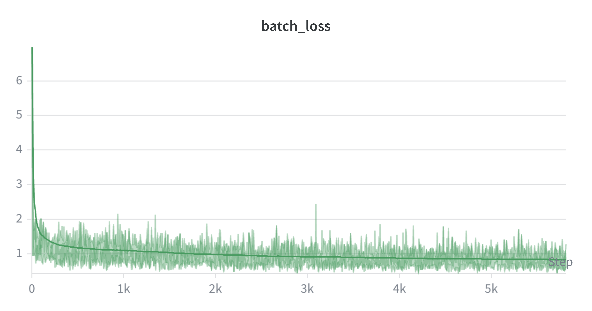
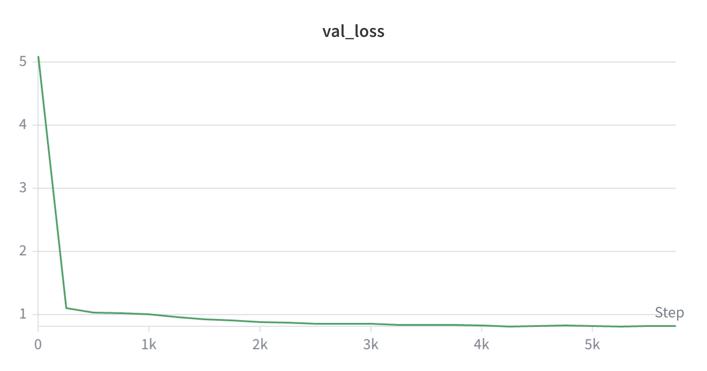
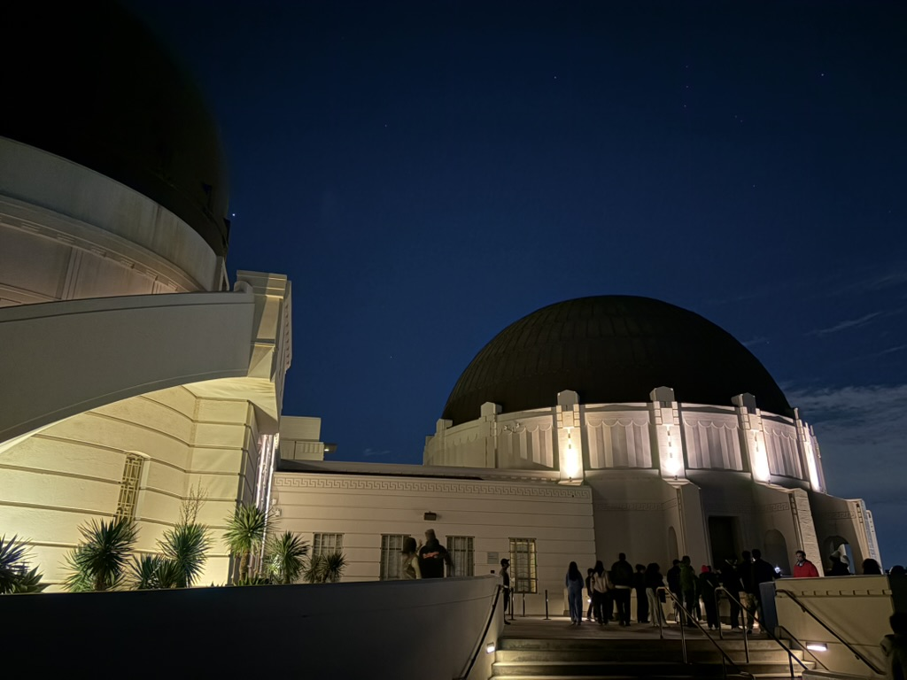
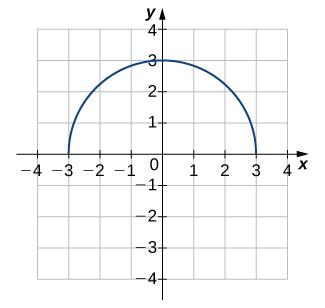

# mini-vlm

A compact Vision-Language Model built from scratch using PyTorch and Hugging Face Transformers.

## Overview

**mini-vlm** combines a vision encoder and a language model with a learned modality projector:

- **Vision backbone:** [SigLIP-2 Base](https://huggingface.co/google/siglip2-base-patch16-512) (512×512 tiles, 768-dim)
- **Language backbone:** [Qwen3-0.6B](https://huggingface.co/Qwen/Qwen3-0.6B)
- **Modality projector:** Pixel-shuffle compression (64 tokens per tile) + linear projection to the LLM hidden size

Features:

- Tiled high-resolution support (up to 1536px) with optional global context
- Interleaved multimodal processing via image token placeholders
- Greedy Knapsack packing for efficient tokenization
- Training with [FineVision](https://huggingface.co/datasets/HuggingFaceM4/FineVision_concat_shuffled_2) and streaming datasets

## Installation

```bash
git clone https://github.com/knarfthekant/mini-vlm.git
cd mini-vlm
pip install -r requirements.txt
```

Requirements: Python 3.12+, PyTorch 2.10+, CUDA 12.x (for GPU training).

## Usage

### Training

```bash
python train.py
```

Optional arguments (override defaults in `configs/TrainConfig.py` and `configs/VLMConfig.py`):

```bash
python train.py --train_dataset_path HuggingFaceM4/FineVision_concat_shuffled_2 \
  --lr_mp 1e-3 --lr_vision_backbone 1e-5 --lr_language_backbone 1e-5 \
  --vlm_checkpoint_path checkpoints --no_log_wandb
```

### Inference

```bash
python generate.py --checkpoint path/to/checkpoint --image assets/photo.jpg --prompt "Describe this image."
```

| Option | Description | Default |
|--------|-------------|---------|
| `--checkpoint` | Path to model checkpoint (dir or safetensors) | Required |
| `--image` | Input image path | `assets/image.jpg` |
| `--prompt` | Text prompt | `"Use the horizontal line test to determine whether each of the given graphs is one-to-one."` |
| `--generations` | Number of outputs | 5 |
| `--max_new_tokens` | Max tokens per output | 300 |
| `--measure_vram` | Report VRAM usage | False |

### Evaluation

Run [lmms-eval](https://github.com/EvolvingLMMs-Lab/lmms-eval) on a checkpoint:

```bash
python evaluation.py --model path/to/checkpoint \
  --run_name my_run --tasks mmstar,mmmu_val,textvqa_val --batch_size 32
```

For more architecture and pipeline details, see [`docs/specitication.md`](docs/specitication.md) and [`docs/planning.md`](docs/planning.md).

## Training Summary

The evaluated checkpoint was trained for **4500 steps** (~16 hours) on a single **RTX 5090**.

| Setting | Value |
|---------|-------|
| Vision encoder | `google/siglip2-base-patch16-512` |
| Language model | `Qwen/Qwen3-0.6B` |
| Modality projector | Pixel-shuffle ×4, 64 tokens/tile |
| Max image size | 1536px (resize to max side) |
| Max sequence length | 4096 tokens |
| Batch size | 16 (4 per device × 4 gradient accumulation steps) |
| Hardware | 1× NVIDIA RTX 5090 |
| Training time | ~16 hours |
| Dataset | [HuggingFaceM4/FineVision](https://huggingface.co/datasets/HuggingFaceM4/FineVision_concat_shuffled_2) |

**Batch loss and validation loss:**






## Benchmark

MMStar (0-shot) results: (step 4250)

| Metric | Value | Stderr (CLT) |
|--------|------:|-------------:|
| average | 32.91% | 1.20% |
| coarse perception | 43.94% | 3.10% |
| fine-grained perception | 25.29% | 2.82% |
| instance reasoning | 35.20% | 3.06% |
| logical reasoning | 31.29% | 2.95% |
| math | 35.59% | 2.99% |
| science & technology | 26.12% | 2.64% |

## Demo

### photo.jpg



- **Input:** Describe this image. Where might it have been taken? 
- **Output:** It appears to be a nighttime image captured during a night sky observation event. The sky is dark, with a clear blue color, indicating it is a clear night. The ground is mostly brown, with the presence of a large, dark, circular object visible in the upper left corner of the image, which is likely a dome-shaped structure of the International Space Station. The buildings in the background are white, suggesting they are residential or commercial buildings. The sky is also dark, and the sky is partially obscured by the dome, which may be part of the observation dome or a dome structure used for the event. The image captures a group of people standing on the ground, some of whom are wearing hats, and there are people standing on the steps of a building. The sky is also partially obscured by the dome, and the buildings are partially visible. The overall composition of the image is filled with a sense of isolation and the vastness of space.

### image.jpg



- **Input:** Use the horizontal line test to determine whether each of the given graphs is one-to-one.

- **Output:** Using the horizontal line test, examine the graphs for the presence of horizontal lines that intersect more than one point. If any such lines intersect more than one point, the graph is not one-to-one. The graphs given are not one-to-one due to the horizontal lines intersecting more than one point. Therefore, the answer is No

## Reference
huggingface/nanoVLM

## License

See repository for license details.
