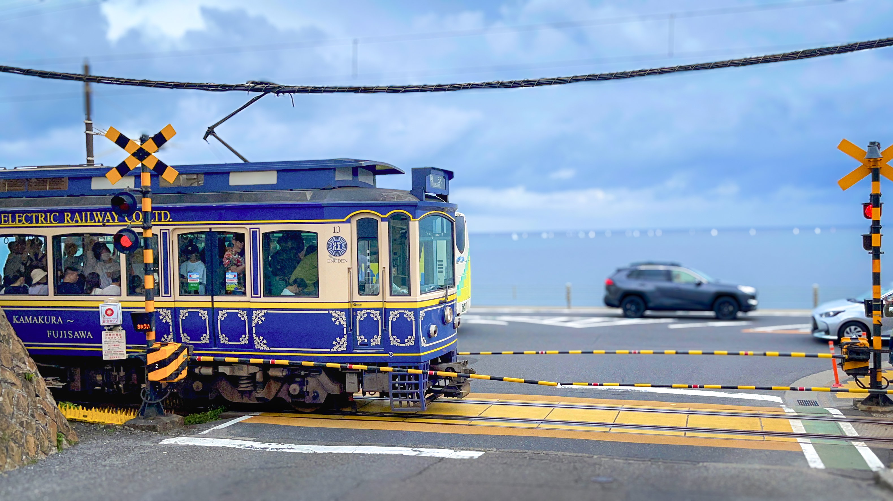
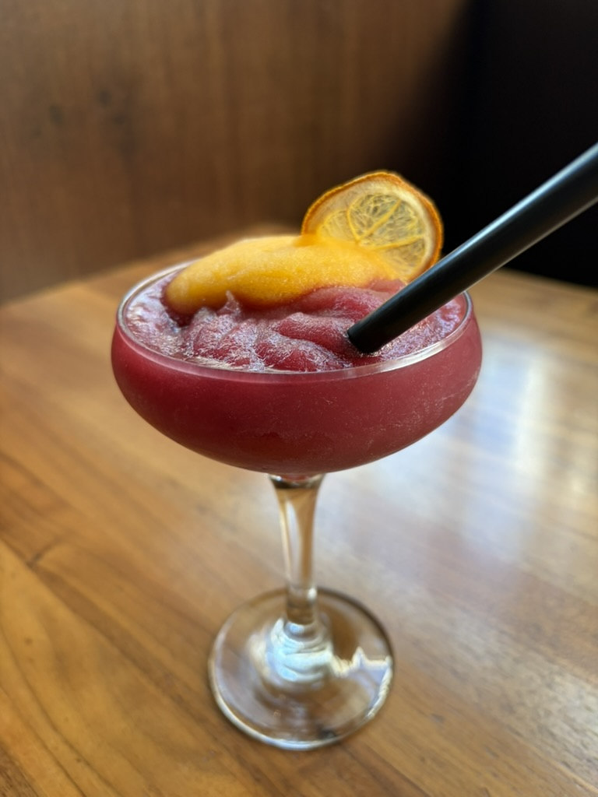

# mini-vlm

## Overview

## Installation

## Usage

## Demo

### photo.jpg

- **Input:** Which country was this picture taken in?
- **Output:** 
    - Generation 1: This picture was taken in Japan.
    - Generation 2: This picture is taken in Kamakura, Japan.
    - Generation 3: This picture is taken in Japan.
    - Generation 4: This picture was taken in Japan.
    - Generation 5: This picture was taken in Japan.

### photo1.jpeg

- **Input:** Describe this photo.
- **Output:** The image shows a clear, red, and orange cocktail glass with a thin rim. The glass is placed on a wooden table, and there is a black straw and a piece of orange peel on the table. The glass has a translucent appearance, which suggests it may be made of a material that allows light to filter through, creating a sense of depth. The drink inside the glass is a vibrant mixture of orange juice, red wine, and a sweetened syrup, which gives the glass a glossy, glossy look. The orange peel is visible on the table, and the straw is visible at the top of the glass. The background is blurred, but it is not clear whether it is a real environment or a backdrop to the image.

## License
