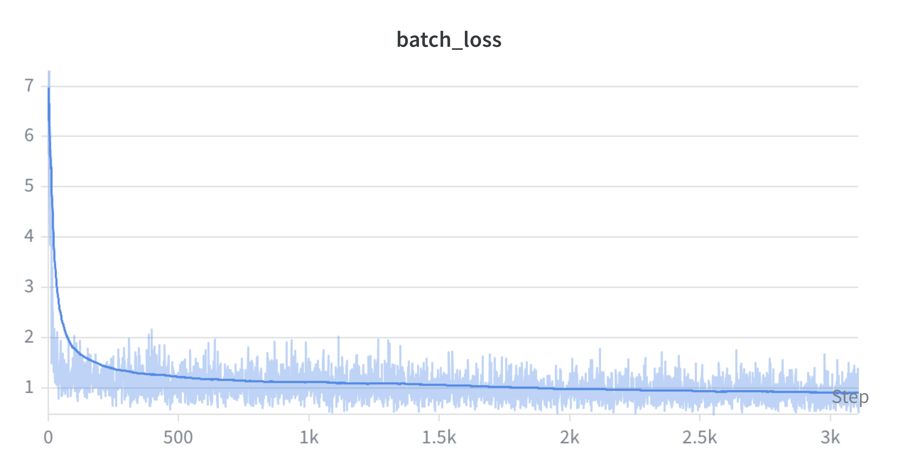
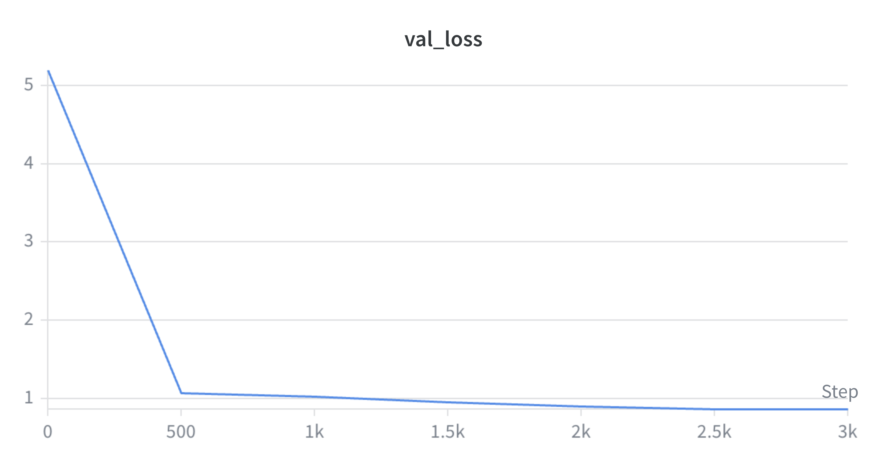

# mini-vlm

A compact Vision-Language Model built from scratch using PyTorch and Hugging Face Transformers.

## Overview

**mini-vlm** combines a vision encoder and a language model with a learned modality projector:

- **Vision backbone:** [SigLIP-2 Base](https://huggingface.co/google/siglip2-base-patch16-512) (512×512 tiles, 768-dim)
- **Language backbone:** [Qwen3-0.6B](https://huggingface.co/Qwen/Qwen3-0.6B)
- **Modality projector:** Pixel-shuffle compression (64 tokens per tile) + linear projection to the LLM hidden size

Features:

- Tiled high-resolution support (up to 1536px) with optional global context
- Interleaved multimodal processing via image token placeholders
- Token-search for stable image token alignment (avoids BPE drift)
- Training with [FineVision](https://huggingface.co/datasets/HuggingFaceM4/FineVision_concat_shuffled_2) and streaming datasets

## Installation

```bash
git clone https://github.com/knarfthekant/mini-vlm.git
cd mini-vlm
pip install -r requirements.txt
```

Requirements: Python 3.12+, PyTorch 2.10+, CUDA 12.x (for GPU training).

## Usage

### Training

```bash
python train.py
```

Optional arguments (override defaults in `configs/TrainConfig.py` and `configs/VLMConfig.py`):

```bash
python train.py --train_dataset_path HuggingFaceM4/FineVision_concat_shuffled_2 \
  --lr_mp 1e-3 --lr_vision_backbone 1e-5 --lr_language_backbone 1e-5 \
  --vlm_checkpoint_path checkpoints --no_log_wandb
```

### Inference

```bash
python generate.py --checkpoint path/to/checkpoint --image assets/photo.jpg --prompt "Describe this image."
```

| Option | Description | Default |
|--------|-------------|---------|
| `--checkpoint` | Path to model checkpoint (dir or safetensors) | Required |
| `--image` | Input image path | `assets/photo.jpg` |
| `--prompt` | Text prompt | `"What is this?"` |
| `--generations` | Number of outputs | 5 |
| `--max_new_tokens` | Max tokens per output | 300 |
| `--measure_vram` | Report VRAM usage | False |

### Evaluation

Run [lmms-eval](https://github.com/EvolvingLMMs-Lab/lmms-eval) on a checkpoint:

```bash
python run_evaluation.py --checkpoint_path path/to/checkpoint --global_step 0 \
  --run_name my_run --tasks mmstar,mmmu_val,textvqa_val --batch_size 32
```

For more architecture and pipeline details, see [`docs/specitication.md`](docs/specitication.md) and [`docs/planning.md`](docs/planning.md).

## Training Summary

The evaluated checkpoint was trained for **3000 steps** (~11 hours) on a single **RTX 5090**.

| Setting | Value |
|---------|-------|
| Vision encoder | `google/siglip2-base-patch16-512` |
| Language model | `Qwen/Qwen3-0.6B` |
| Modality projector | Pixel-shuffle ×4, 64 tokens/tile |
| Max image size | 1536px (resize to max side) |
| Max sequence length | 4096 tokens |
| Batch size | 16 (4 per device × 4 gradient accumulation steps) |
| Hardware | 1× NVIDIA RTX 5090 |
| Training time | ~11 hours |
| Dataset | [HuggingFaceM4/FineVision](https://huggingface.co/datasets/HuggingFaceM4/FineVision_concat_shuffled_2) |

**Batch loss and validation loss:**






## Benchmark

MMStar (0-shot) results:

| Metric | Value | Stderr (CLT) |
|--------|------:|-------------:|
| average | 32.18% | 1.21% |
| coarse perception | 42.50% | 3.11% |
| fine-grained perception | 28.00% | 2.87% |
| instance reasoning | 35.63% | 3.05% |
| logical reasoning | 25.20% | 2.82% |
| math | 35.62% | 3.03% |
| science & technology | 26.11% | 2.77% |

## Demo

### photo.jpg


- **Input:** Which country was this picture taken in?
- **Output:** 
    - Generation 1: This picture was taken in Japan.
    - Generation 2: This picture is taken in Kamakura, Japan.
    - Generation 3: This picture is taken in Japan.
    - Generation 4: This picture was taken in Japan.
    - Generation 5: This picture was taken in Japan.

### photo1.jpeg


- **Input:** Describe this photo.
- **Output:** The image shows a clear, red, and orange cocktail glass with a thin rim. The glass is placed on a wooden table, and there is a black straw and a piece of orange peel on the table. The glass has a translucent appearance, which suggests it may be made of a material that allows light to filter through, creating a sense of depth. The drink inside the glass is a vibrant mixture of orange juice, red wine, and a sweetened syrup, which gives the glass a glossy, glossy look. The orange peel is visible on the table, and the straw is visible at the top of the glass. The background is blurred, but it is not clear whether it is a real environment or a backdrop to the image.

## Reference
huggingface/nanoVLM

## License

See repository for license details.
